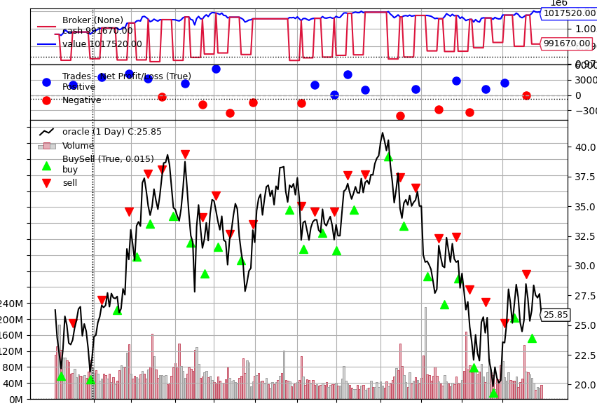

# Backtrader 
[Backtrader](https://www.backtrader.com/) is a Python framework for backtesting trading strategies. 
 
 
[strategies.py](strategies.py) contains a simple test strategy where we: 
 
-buy 1000 shares of stock after a consecutive 2-day dip in price
 
-sell all shares after 5 day holding period  
 

### Strategy Performance 
Test strategy was implemented on historical Oracle price data from 2000-01-03 &nbsp;&nbsp;-&nbsp;&nbsp; 2000-12-29

